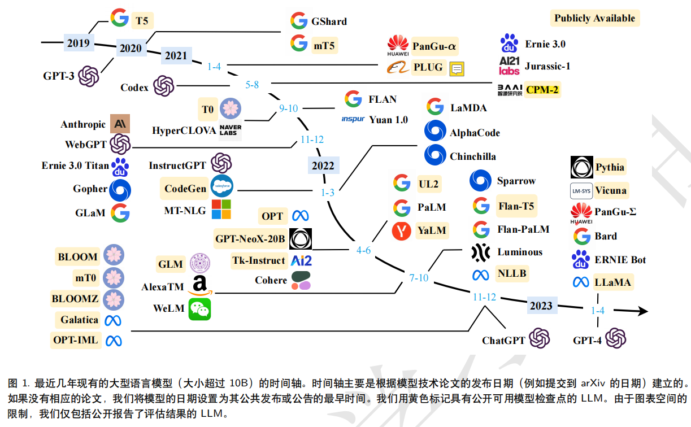

大语言模型的发展历程虽然只有短短不到五年的时间，但是发展速度相当惊人，截止 2023 年
6 月，国内外有超过百种大模型相继发布。按照时间线给出 2019 年至 2023 年 5 月比较有影响力并且模型参数量超过 100 亿的大语言模型，如下图所示：

（该图来源于参考内容 [1] ）

大语言模型的发展可以粗略的分为如下三个阶段：基础模型、能力探索、突破发展。

## 1. 基础模型

在基础模型阶段，时间主要集中在 2018 年到 2021 年。这一时期，机器学习领域发生了一场颠覆性的变革。2017 年，Vaswani 等人提出了一种叫做 Transformer 的架构，它在机器翻译领域大放异彩。

接着，2018年，Google 和 OpenAI 分别发布了 BERT 和 GPT-1 模型，标志着预训练语言模型的时代正式开始。当时的 BERT-Base 版本有 1.1 亿个参数，BERT-Large 则有 3.4 亿个，而 GPT-1 则有 1.17 亿。这在当时，相比其它深度神经网络的参数量，可是相当了不起的规模！

接着，2019 年，OpenAI 发布了GPT-2，参数规模达到了 15 亿。后来，Google 也发布了参数多达 110 亿的 T5 模型。2020 年，OpenAI 再次刷新记录，将语言模型的参数数量扩展到了 1750 亿，并发布了 GPT-3 。此外，国内也相继推出了一系列大型语言模型，包括清华大学的 ERNIE(THU) 、百度的 ERNIE(Baidu) 、华为的盘古-α 等。

这个时期的研究主要集中在改进语言模型本身，包括仅有编码器（Encoder Only）、编码器-解码器（Encoder-Decoder）、仅有解码器（Decoder Only）等各种不同的模型结构。模型大小与 BERT 相类似，这些模型通常采用预训练微调范式，针对不同下游任务进行微调。但是，当模型的参数数量超过 10 亿时，由于微调需要大量计算，这类模型的影响力在当时相较 BERT 类模型有不小的差距。

## 2. 能力探索

在能力探索阶段，时间主要集中在 2019 年到 2022 年。因为大型语言模型很难为特定任务进行微调，所以研究人员们开始思考如何在不针对单一任务进行微调的情况下，充分发挥大语言模型的能力。

2019 年，聪明的 Radford 和他的团队使用 GPT-2 模型研究了大型语言模型在`零样本任务`处理方面的潜力。在此基础上，Brown 等人在 GPT-3 模型上研究了通过上下文学习（In-Context Learning）进行`少样本学习`的方法。他们将不同任务的少量有标注的实例拼接到待分析的样本之前输入语言模型，使用语言模型根据实例理解任务并给出正确结果。这一方法在 TrivaQA、WebQS、CoQA 等多个测试集上表现出了强大的能力，有时甚至超越了以前的有监督方法。这些方法不需要修改语言模型的参数，也不需要为不同任务进行大规模微调。

但是，仅仅依靠语言模型本身，性能在许多任务上仍然难以达到实际应用的水平。因此，聪明的研究人员们提出了`指令微调（Instruction Fine-tuning）`方案，将各种类型的任务统一为`生成式自然语言理解`框架，并构建了训练数据进行微调。这就好比是一次性学会了处理成千上万种任务，并且在面对全新任务时表现出了出色的适应能力。

2022年，聪明的 Ouyang 提出了 `InstructGPT` 算法，结合了`有监督微调`和`强化学习`方法，使大语言模型**在只有少量数据的情况下就能够听从人类的指令**。此外，Nakano等人还研究了结合搜索引擎的问题回答算法 WebGPT 。

这些方法从直接使用大型语言模型进行零样本和少样本学习，逐渐发展到使用生成式框架为大量任务进行有监督微调，从而显著提高了模型的性能。

### 3. 突破发展

突破发展阶段以 2022 年 11 月 ChatGPT 的发布为起点。ChatGPT 通过一个简单的对话框，利用一个大语言模型就可以实现问题回答、文稿撰写、代码生成、数学结题等过去自然语言处理系统需要大量小模型订制开发才能分别实现的能力。它在开放领域问答、各类自然语言生成式任务以及对话上文理解上所展现出来的能力远超大多数人的想象。2023 年 3 月 GPT-4 发布，相较于ChatGPT 又有了非常明显的进步，并具备了多模态理解能力。GPT-4 在多种基准考试测试上的得分高于 88% 的应试者，包括美国律师资格考试（Uniform Bar Exam）、法学院入学考试（Law School Admission Test）、学术能力评估（Scholastic Assessment Test，SAT）等。它展现了近乎“通用人工智能（AGI）”的能力。各大公司和研究机构也相继发布了此类系统，包括 Google 推出的 Bard、百度的文心一言、科大讯飞的星火大模型、智谱 ChatGLM、复旦大学 MOSS 等。表1.1和表1.2分别给出了截止 2023 年 6 月典型开源和未开源大规模语言模型的基本情况。我们可以看到从 2022 年开始大模型呈现爆发式的增长，各大公司和研究机构都在发布各种不同类型的大模型。

突破发展阶段从 2022 年 11 月发布的 ChatGPT 开始。ChatGPT 通过一个简单的对话框，利用大型语言模型就可以实现问题回答、文稿撰写、代码生成、数学题解等多种任务，而以往需要专门订制小型模型才能完成。它在开放领域问答、各类自然语言生成任务以及对话上下文理解等方面展现出了令人难以置信的能力。

2023 年 3 月，GPT-4 发布，相较于 ChatGPT 有了显著的进步，还具备了多模态理解能力。GPT-4 在多项标准测试中表现出色，包括美国律师资格考试、法学院入学考试、学术能力评估等。它几乎具备了通用人工智能（AGI）的能力。

各大公司和研究机构也纷纷发布了类似的系统，如 Google 的 `Bard` 、百度的`文心一言`、科大讯飞的`星火大模型`、智谱的`ChatGLM`、复旦大学的`MOSS`等。表1.1和表1.2分别提供了截止2023年6月的典型开源和未开源大型语言模型的基本情况(来源见参考内容 [2])。我们可以看到，从2022年开始，大型模型呈现出爆发式的增长，各大公司和研究机构都在推出各种类型的大型模型。

参考内容：
[1] arXiv:2303.18223 [cs.CL]https://doi.org/10.48550/arXiv.2303.18223
[2] 张奇、桂韬、郑锐、黄萱菁，大语言模型理论与实践，https://intro-llm.github.io/, 2023.

